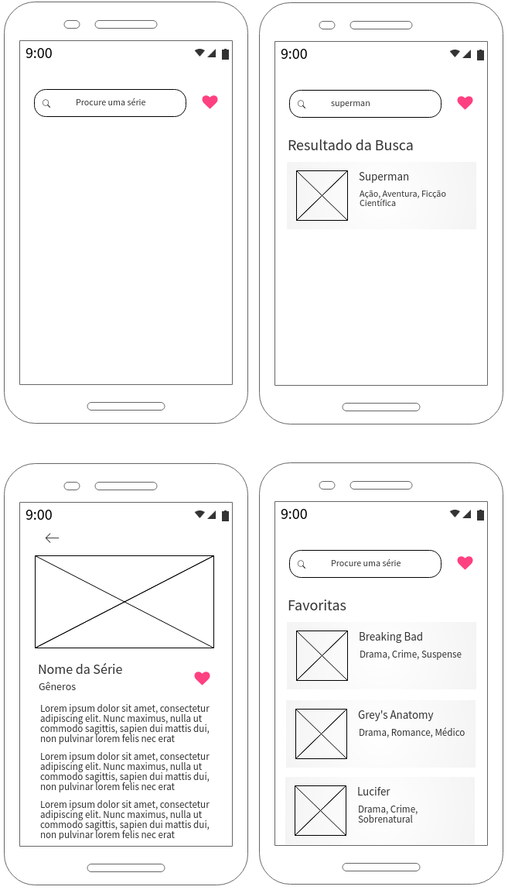
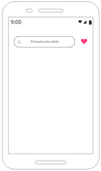
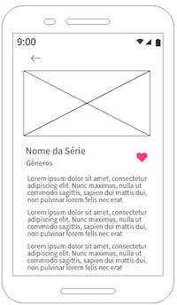
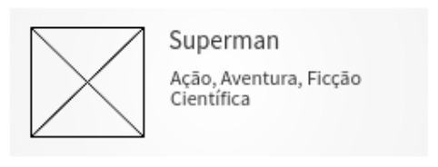
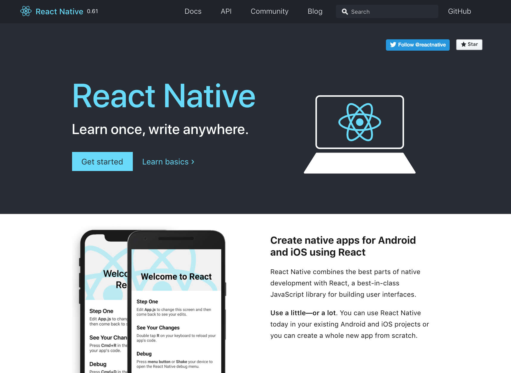
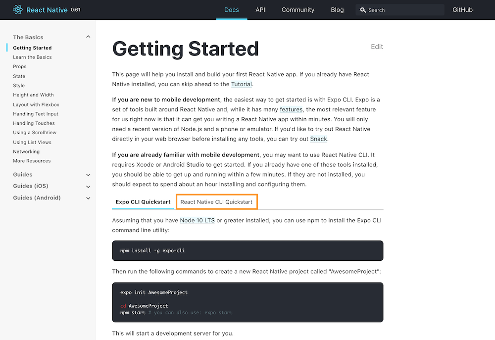
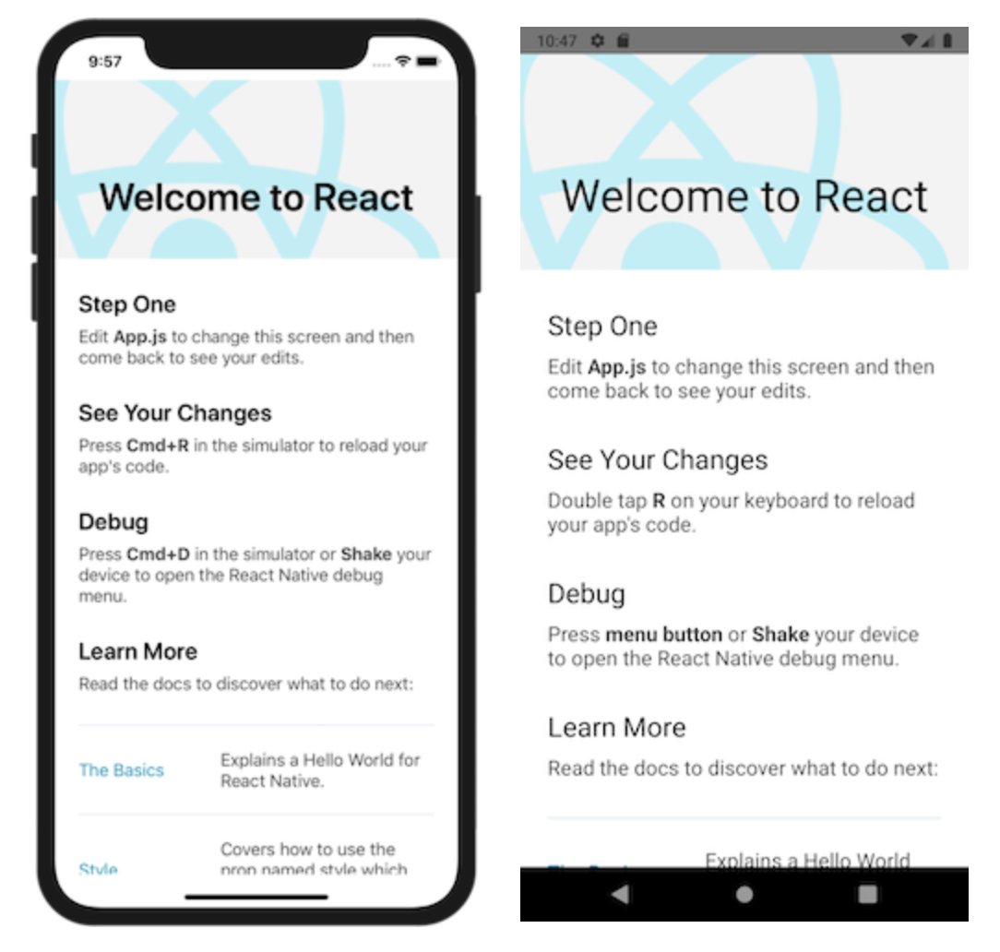
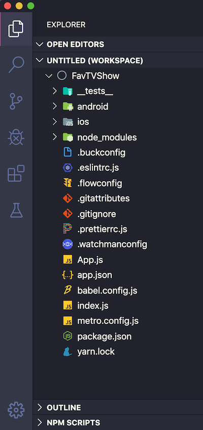

# Tutorial React Native

O objetivo deste tutorial é guiar você nos primeiros passos com o React Native. 

Vamos construir um aplicativo utilizando a [API TV Maze](https://www.tvmaze.com/api) e seguindo o protótipo abaixo:

<div align="center">

</div>

---

## 1. Como será o aplicativo?

Antes de começar a escrever código, é importante entender os comportamentos associados a cada tela.

### 1.1. Tela inicial

Esta é a tela que o usuário visualizará ao iniciar o aplicativo.



Ela deverá ter uma barra de busca e, do lado direito da barra, um botão.

A barra de busca deverá ter um placeholder. Ao digitar uma palavra para ser buscada, devemos utilizar o botão que o teclado disponibilizar para iniciar a busca, por exemplo, como o que ocorre quando digitamos uma URL no navegador do celular.

Encontrando resultados, deverão ser exibidos abaixo da barra de busca e abaixo do título "Resultado da Busca", um por linha. Caso não obtenha nenhum resultado, deverá exibir a mensagem "Nenhum resultado encontrado".

Os resultados deverão ser exibidos como "cards" contendo a imagem, o nome da série e os gêneros atribuídos a ela (ver seção 1.3).

Quando o usuário selecionar um dos resultados, deverá ser levado a uma outra tela que mostrará as informações completas da série. Descreveremos essa tela em breve.

O botão à direita da barra de busca, ao ser clicado, deverá mostrar as séries preferidas do usuário abaixo do título "Favoritas".

Se não houver busca em andamento, não exibir nada na tela.

Se não houver nenhuma série favoritada, exibir a mensagem "Você ainda não tem séries favoritas".

### 1.2. Tela de detalhes da série

Quando o usuário clicar em uma série, seja nos resultados da busca ou nas favoritadas, deverá ser levado para esta tela.



Esta tela deverá mostrar uma imagem associada à série, o nome, os gêneros e o sumário.

Ao lado do nome e dos gêneros, deverá ter uma botão para que o usuário possa favoritar a série.

Quando o usuário clicar no botão para favoritar a série, os dados deverão ser salvos no armazenamento global interno do aplicativo ([AsyncStorage](https://facebook.github.io/react-native/docs/asyncstorage)) e deverá existir algum retorno visual para o usuário que poderá ser um "toast" ou similar.

Acima da imagem da série, deverá ter um botão de voltar que levará para a tela anterior.

O usuário deverá poder rolar a tela, pois o conteúdo do sumário pode ser maior do que o tamanho da tela do aparelho.

### 1.3. Componente para exibir as séries

O usuário verá uma lista de séries quando fizer uma busca e obtiver pelo menos um resultado ou quando acessar suas séries favoritadas. 

Para esta finalidade, deveremos construir um componente tipo *card* conforme imagem abaixo:

<div align="center">

</div>

Os cards deverão ser clicáveis e exibidos numa [FlatList](https://facebook.github.io/react-native/docs/flatlist).

---

## 2. Instalando as dependências necessárias

Chegou a hora de começar o projeto! Para isso, visite a página do [React Native](https://facebook.github.io/react-native/) e clique em **Get started**.

<div align="center"></div>

Na página **Getting Started**, você encontrará todas as informações necessárias para começar com o React Native. Para este tutorial, sugerimos que você escolha a opção **React Native CLI Quickstart**.

<div align="center"></div>

Em seguida, escolha a melhor opção que se encaixa com o seu perfil. No meu caso, vou desenvolver utilizando um Mac, então em *Development OS* escolhi **macOS** e como testarei utilizando o iPhone, em *Target OS*, escolhi o target como **iOS**, mas poderia ter escolhido **Android**.

<div align="center"></div>

Você só poderá escolher *Target OS*  como **iOS** se estiver utilizando um Mac. Para **Windows** e **Linux**, você deverá escolher obrigatoriamente **Android**.

Após selecionar as opções de acordo com seu sistema operacional, siga as instruções para a instalação das dependências necessárias para utilizar o React Native.

---

## 3. Vamos começar!

Após concluir a instalação de todas as dependências conforme o passo-a-passo do site do React Native, você poderá inicializar seu projeto com o seguinte comando:

```sh
npx react-native init NomeDoProjeto
```

A criação do projeto pode levar alguns minutos, não se preocupe e acompanhe os logs pelo terminal :)

Quando o processo estiver concluído, você poderá rodar seu projeto com os seguintes comandos:

```sh
cd NomeDoProjeto
npx react-native run-ios
```
Caso você esteja utilizando o macOS. Ou, caso você esteja utilizando o Windows ou o Linux:

```sh
cd NomeDoProjeto
npx react-native run-android
```
Após algum tempo - e na primeira vez que executamos este comando pode realmente levar um bom tempo - você verá algo parecido com isso (dependendo do *Target OS*):

<div align="center"></div>

**Importante:** Note que o texto padrão do projeto na primeira execução (sem alterações) menciona opções para você visualizar suas alterações (reload) e também para debugar. Isso quer dizer que você pode alterar o código e ver as alterações e fazer debug em tempo real.

Para você modificar o projeto, você deverá utilizar um editor de código de sua preferência:

* [Atom](https://atom.io/)
* [Sublime](https://www.sublimetext.com/)
* [Visual Studio Code](https://code.visualstudio.com/)

Ao abrir o projeto no editor de código de sua escolha, você verá esta estrutura de pastas e arquivos:

<div align="center"></div>

**Obs.:** Essa é a barra lateral do meu Visual Studio Code. Estou utilizando um tema diferente do padrão e também tenho uma extensão que modifica as imagens dos ícones associados a cada arquivo ou pasta. O nome que eu dei para o meu projeto é *FavTVShow*.

O que é importante saber aqui:

* As pastas *android* e *ios* contêm o código nativo gerado. Você pode rodar seu aplicativo no Android Studio ou no Xcode abrindo essas pastas em cada IDE respectivamente. Essas pastas são importantes para gerar o release do seu aplicativo.

* A pasta *node_modules* contém todas as dependências do projeto instaladas pelo npm.

* O aplicativo pode ser inicialmente editado através do arquivo *App.js*.

* O arquivo *index.js* busca e registra o componente global do nosso aplicativo, ou seja, o primeiro componente a ser carregado. Ele importa o conteúdo do arquivo *App.js* e renderiza na tela.

* O arquivo package.json contém todos os dados das dependências e também de scripts relacionados ao seu projeto.

---

## 4. Escrevendo o nosso App.js

Apague todo o conteúdo do arquivo App.js e substitua por:

```js
import React, {Component} from 'react'; // 1
import {Text, View, StyleSheet} from 'react-native'; // 2

// 3
export default class App extends Component {
  render() {
    return (
      // 4
      <View style={styles.hello}>
        <Text>Hello, world!</Text>
      </View>
    );
  }
}

// 5
const styles = StyleSheet.create({
  hello: {
    flex: 1,
    justifyContent: 'center',
    alignItems: 'center',
  },
});

```

1. Importamos o React e também a classe Component para ser utilizada diretamente. Se não importássemos Component aqui, em **3** teríamos que usar *React.Component* invés de apenas *Component*.
2. Importamos as classes Text, View e StyleSheet do React Native para que possamos utilizá-las na renderização de conteúdo na tela.
3. Precisamos exportar nossa classe *App* aqui como um componente. Lembra do *index.js*? Então, exportamos App como um componente que será lido e registrado pelo *index.js*. Nossa classe vai renderizar o que estiver dentro do *return*.
4. Aqui temos um componente *View* que recebe a customização através de um estilo. Dentro desse componente, temos um componente *Text* que recebe o conteúdo 'Hello, world!' e não possui nenhuma customização.
5. Declaramos uma constante *styles* que receberá um objeto com os estilos que queremos utilizar. Por enquanto temos somente um, o *hello*, que utilizamos na customização da *View*.

Quando você remove o conteúdo de App.js, coloca este conteúdo novo e salva o arquivo, se você estiver com o simulador rodando, ele recarrega automaticamente a visualização.

Não deixe de ler a documentação oficial sobre os componentes [Text](https://facebook.github.io/react-native/docs/text) e [View](https://facebook.github.io/react-native/docs/view) e da abstração [StyleSheet](https://facebook.github.io/react-native/docs/stylesheet). 

Vamos modificar um pouco o estilo do texto no componente *Text*. Primeiro, reescreva a linha do componente *Text* de modo que ela fique assim:

```html
<Text style={styles.text}>Hello, world!</Text>
```
Depois, acrescente o estilo *text* em *styles*. Ficará assim:

```js
const styles = StyleSheet.create({
  hello: {
    flex: 1,
    justifyContent: 'center',
    alignItems: 'center',
  },
  text: { 
    fontSize: 30,
    color: 'blue',
  },
});
```
Veja o resultado no simulador quando você salvar o arquivo! :)

---

## 5. Vamos à primeira tela do projeto!

Precisamos começar a dar uma cara para o nosso projeto conforme o protótipo. Faremos isso da maneira mais simples possível, pelo menos inicialmente.

Como podemos adicionar os elementos necessários da tela inicial? Um deles é uma barra de busca. Existem bibliotecas com esse componente pronto, mas para que possamos aprender como fazer, não iremos utilizá-las.

Vamos adicionar o componente *TextInput* à nossa segunda linha de *import*. Veja a documentação deste componente [aqui](https://facebook.github.io/react-native/docs/textinput).

```js
import {Text, View, StyleSheet, TextInput} from 'react-native';
```
Vamos modificar o trecho de código que cuida da renderização da tela para ficar assim:

```js
export default class App extends Component {
  render() {
    return (
      <View style={styles.screen}>
        <View style={styles.search}>
          <TextInput style={styles.input} />
        </View>
        <View style={styles.results}>
          <Text>Os resultados aparecerão aqui</Text>
        </View>
      </View>
    );
  }
}
```

Temos um componente *View* que encapsula todos os elementos da tela e ele recebe o estilo *screen*. 

Dentro deste componente, temos outros dois componentes do tipo *View*: um no topo (fundo branco) que recebe o estilo *search* e outro embaixo (fundo temporariamente cinza claro para visualização) que recebe o estilo *results*. 

Dentro do componente do topo, temos o componente *TextView*. E dentro do componente da parte de baixo da tela temos o componente *Text*.

Agora vamos modificar os estilos para que eles fiquem desta maneira:

```js
const styles = StyleSheet.create({
  screen: {
    flex: 1,
    flexDirection: 'column',
  },
  search: {
    flex: 1,
    justifyContent: 'center',
    alignItems: 'center',
  },
  input: {
    marginTop: 55,
    height: 40,
    width: 250,
    borderColor: 'lightgray',
    borderWidth: 1,
    padding: 10,
    fontSize: 20,
  },
  results: {
    flex: 4,
    backgroundColor: 'lightgray',
    alignItems: 'center',
  },
});
```

Faça as alterações e salve o arquivo. Agora veja a explicação para cada item:

* O componente *View* que engloba todos os outros componentes (estilo de nome *screen*) possui flex igual a 1. Isso faz com que ele tome a tela toda, uma vez que ele engloba todos os outros. Ele possui flexDirection igual a *column* porque queremos que os componentes dentro dele se organizem verticalmente.

* Temos o componente *View* com estilo *search* que fica em cima e o *View* com estilo *results* que fica em baixo. Eles estão dentro do componente *View* com estilo *screen* e se organizam verticalmente. Eles têm que dividir o mesmo espaço. Fazemos isso utilizando o flex. O de cima tem flex 1 e o de baixo 4. Isso quer dizer que temos 5 partes proporcionais (1+4), o que tem flex igual a 1 ocupa 1/5 e o que tem flex igual a 4 ocupa 4/5. **Importante:** Veja a documentação do React Native para aprender mais sobre [Flexbox](https://facebook.github.io/react-native/docs/flexbox) :)

* Olhando ainda para o componente *View* com estilo *search*, dentro dele colocamos o componente *TextView* que está customizado com o estilo *input*. Com ele, pudemos definir sua altura (height), largura (width), distância da margem superior da tela (marginTop), cor da borda (borderColor), espessura da borda (borderWidth), preenchimento em volta (padding) e o tamanho da fonte do campo (fontSize). 

No simulador, se você clicar no *TextInput*, o teclado aparece automaticamente. Você pode digitar algo e clicar em "return"(no caso do iOS). Por enquanto, nada vai acontecer porque ainda precisamos implementar o comportamento.

Vamos adicionar uma variável chamada *state* antes da função *render()* que receberá o texto digitado no *TextInput*.

```js
  state = {
    searchText: '',
  }
```

Também vamos alterar o *TextInput* para ter um placeholder e para que ele salve na variável *state* o texto digitado. Ele ficará assim:

```js
  <TextInput
    placeholder={'Procure uma série'}
    style={styles.input}
    onChangeText={(text) => this.setState({ searchText: text })}
  />
```

Note o método *onChangeText* do componente. Ele recebe o valor de *text* e salva (this.setState) em *searchText*. Podemos verificar isso em tempo real fazendo uma pequena alteração em outro componente.

Onde temos:

```html
<Text>Os resultados aparecerão aqui</Text>
```
Troque por:

```html
<Text>{this.state.searchText}</Text>
```
Salve e faça o teste de digitar algo no *TextInput* :)

Alterando mais um pouquinho nosso *TextInput*, vamos utilizar o método *onSubmitEditing* para que a busca ocorra quando o usuário pressionar a tecla *return* (ou equivalente no Android). Por enquanto ainda não faremos nenhuma requisição à API, mas vamos deixar as coisas encaminhadas!

Nosso *TextInput* ficará assim:

```js
  <TextInput
    placeholder={'Procure uma série'}
    style={styles.input}
    onChangeText={(text) => this.setState({ searchText: text })}
    onSubmitEditing={() => this.submitSearch()}
  />
```

Precisamos adicionar a função *submitSearch()*, isso pode ser feito logo abaixo de *state*. Ficará assim:

```js
  state = {
    searchText: '',
  }

  submitSearch() { 
    alert('Buscar: ' + this.state.searchText);
  }
```

Como não estamos fazendo a requisição ainda, coloquei um *alert* para que você perceba que o conteúdo digitado no campo de texto será utilizado na busca, pois ela ocorrerá dentro da função *submitSearch()*.

--- 

## 6. Entendendo a API

Para que possamos popular nosso aplicativo com dados, vamos utilizar a [API TV Maze](https://www.tvmaze.com/api) que é uma API REST aberta (não precisamos fazer autenticação), gratuita e que retorna os dados no formato JSON.

Vamos analisar um exemplo de busca utilizando esta API. Se quisermos realizar uma busca com a palavra **anatomy**, utilizaremos o seguinte endpoint:

```
[GET] http://api.tvmaze.com/search/shows?q=anatomy
```

Como resultado, teremos o JSON abaixo (apenas um trecho está sendo mostrado) contendo todas as entradas que tenham **anatomy** ou algo parecido:

```json
[
  {
    "score": 20.919525,
    "show": {
      "id": 67,
      "url": "http://www.tvmaze.com/shows/67/greys-anatomy",
      "name": "Grey's Anatomy",
      "type": "Scripted",
      "language": "English",
      "genres": [
        "Drama",
        "Romance",
        "Medical"
      ],
      "status": "Running",
      "runtime": 60,
      "premiered": "2005-03-27",
      "officialSite": "http://abc.go.com/shows/greys-anatomy/",
      "schedule": {
        "time": "21:00",
        "days": [
          "Thursday"
        ]
      },
      "rating": {
        "average": 8.3
      },
      "weight": 99,
      "network": {
        "id": 3,
        "name": "ABC",
        "country": {
          "name": "United States",
          "code": "US",
          "timezone": "America/New_York"
        }
      },
      "webChannel": null,
      "externals": {
        "tvrage": 3741,
        "thetvdb": 73762,
        "imdb": "tt0413573"
      },
      "image": {
        "medium": "http://static.tvmaze.com/uploads/images/medium_portrait/211/529884.jpg",
        "original": "http://static.tvmaze.com/uploads/images/original_untouched/211/529884.jpg"
      },
      "summary": "<p>The doctors of Grey Sloan Memorial Hospital deal with life-or-death consequences on a daily basis -- it's in one another that they find comfort, friendship and, at times, more than friendship. Together they're discovering that neither medicine nor relationships can be defined in black and white. Real life only comes in shades of grey.</p>",
      "updated": 1576320037,
      "_links": {
        "self": {
          "href": "http://api.tvmaze.com/shows/67"
        },
        "previousepisode": {
          "href": "http://api.tvmaze.com/episodes/1749376"
        },
        "nextepisode": {
          "href": "http://api.tvmaze.com/episodes/1760391"
        }
      }
    }
  },
  {
    "score": 15.932307,
    "show": {
      "id": 34388,
      "url": "http://www.tvmaze.com/shows/34388/greys-anatomy-b-team",
      "name": "Grey's Anatomy: B-Team",
      "type": "Scripted",
      "language": "English",
      "genres": [
        "Drama",
        "Romance",
        "Medical"
      ],
      "status": "Ended",
      "runtime": 3,
      "premiered": "2018-01-11",
      "officialSite": "http://abc.go.com/shows/greys-anatomy-b-team",
      "schedule": {
        "time": "",
        "days": [
          "Thursday"
        ]
      },
      "rating": {
        "average": null
      },
      "weight": 80,
      "network": null,
      "webChannel": {
        "id": 95,
        "name": "ABC.com",
        "country": {
          "name": "United States",
          "code": "US",
          "timezone": "America/New_York"
        }
      },
      "externals": {
        "tvrage": null,
        "thetvdb": null,
        "imdb": null
      },
      "image": {
        "medium": "http://static.tvmaze.com/uploads/images/medium_portrait/142/355662.jpg",
        "original": "http://static.tvmaze.com/uploads/images/original_untouched/142/355662.jpg"
      },
      "summary": "<p>A fresh crop of interns face their first day at Grey Sloan Memorial Hospital. Can these new surgeons survive the pressures of high-stakes medicine, intimidating attendings, and cut throat competition?</p>",
      "updated": 1526845476,
      "_links": {
        "self": {
          "href": "http://api.tvmaze.com/shows/34388"
        },
        "previousepisode": {
          "href": "http://api.tvmaze.com/episodes/1390266"
        }
      }
    }
  }
]
```

Você pode visualizar uma versão mais amigável do conteúdo deste JSON utilizando o [JSON Editor Online](https://jsoneditoronline.org/). Já deixei salvo para que você possa visualizar ele todo! Clique [aqui](https://jsoneditoronline.org/?id=df5f255d286b405aa837b53f328b1438) ;)

No JSON Editor Online ficou fácil de ver que se trata de um array com 9 objetos e cada objeto é uma série.

De acordo com o protótipo e com o que implementamos até aqui:
* Sabemos que é possível pegar um texto digitado no *TextInput*;
* Temos um endpoint para o qual podemos passar um texto e ele nos retornará o resultado da busca por aquele termo.

Vamos colocar isso em prática na próxima seção utilizando o [Axios](https://github.com/qiangmao/axios).

---
## 7. Nosso primeiro request

Precisamos instalar a biblioteca Axios no projeto. Faremos isso digitando o seguinte comando no terminal:

```sh
$ npm install axios
```
Depois disso, vamos criar uma pasta **service** e um arquivo **api.js** dentro dela. Vamos colocar o seguinte código no arquivo:

```js
import axios from 'axios'; // 1

// 2
const api = axios.create({
  baseURL: 'http://api.tvmaze.com/',
});

export default api;
```
1. Fazemos o import da biblioteca.
2. Instanciamos o axios utilizando este método para definir a URL da API.

No **App.js**, vamos importar o arquivo **api.js**:

```js
import api from './service/api';
```

E vamos modificar a função *submitSearch()* para ficar assim:

```js
  submitSearch = async () => { // 1
    if (this.state.searchText != '') { // 2
      try { // 3
        const response = await api.get('/search/shows', { // 4
          params: { q: this.state.searchText } // 5
        });
        alert(JSON.stringify(response));
      } catch(error) { 
        alert(JSON.stringify(error));
      }
    }
  }
```

1. Transformamos essa função em assíncrona.
2. Fazemos uma verificação aqui para que a busca só ocorra se houver conteúdo no campo de texto.
3. Vamos usar o try/catch para que possamos controlar melhor o fluxo em caso de erro.
4. Utilizamos a expressão *await* para pausar a execução da função assíncrona até termos uma promise.
5. Lembra do início da seção 6? Veja a URL que utilizamos como exemplo lá. Aqui, precisamos passar o atributo *params* para fazer o mesmo efeito do **q** na URL.

Os alerts dentro do bloco *try* e dentro do bloco *catch* serão úteis para visualizarmos as respostas obtidas na requisição. Em outro momento, utilizaremos essas respostas de outra maneira :)

Veja mais sobre funções assíncronas [aqui](https://developer.mozilla.org/pt-BR/docs/Web/JavaScript/Reference/Statements/funcoes_assincronas) e sobre promises [aqui](https://developer.mozilla.org/pt-BR/docs/Web/JavaScript/Reference/Global_Objects/Promise).

--- 

## 8. Fiz um request, obtive dados... E agora?

Vamos começar a implementar a *FlatList* para exibir a lista de resultados da busca. Vamos modificar nosso import para isso:

```js
import {Text, View, StyleSheet, TextInput, FlatList} from 'react-native';
```

Em seguida, modificaremos o *state* e a função *submitSearch()* para que fiquem assim:

```js
  state = {
    searchText: '',
    searchResults: null, // 1
  }

  submitSearch = async () => {
    if (this.state.searchText != '') { 
      try {
        const response = await api.get('/search/shows', {
          params: { q: this.state.searchText },
        });
        this.setState({ searchResults: response.data }); // 2
      } catch(error) { 
        alert(JSON.stringify(error));
      }
    }
  }
```

1. Colocamos o atributo *searchResults* no *state* inicialmente como **null**.
2. Depois de concluída a requisição, colocamos a resposta no atributo *searchResults*. Note que estamos salvando *response.data* para pegarmos somente o objeto retornado, que é um array com vários shows.

Também temos que modificar o *render()*, inserindo a *FlatList* nele:

```js
  render() {
    return (
      <View style={styles.screen}>
        <View style={styles.search}>
          <TextInput
          placeholder={'Procure uma série'}
          style={styles.input}
          onChangeText={(text) => this.setState({ searchText: text })}
          onSubmitEditing={() => this.submitSearch()}
         />
        </View>
        <View style={styles.results}>
          <FlatList
            data={this.state.searchResults}
            renderItem={({ item }) => <Text>{item.show.name}</Text>}
            keyExtractor={item => item.show.id}
          />
        </View>
      </View>
    );
  }
```
Note que estamos renderizando somente o nome da série com o componente *Text*. Porém, vamos criar o nosso componente tipo *card* aqui, conforme seção 1.3.

## 9. Criando um componente

